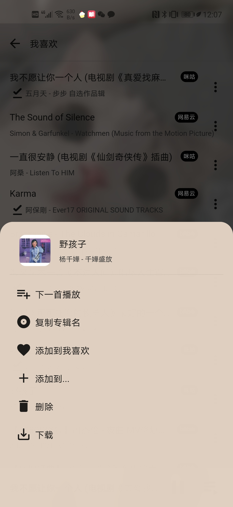

# 🎵谧音 mixinmusic
安静、简单地听音乐。
目前仅支持安卓平台。

下载链接：[百度云](https://pan.baidu.com/s/1YnYUj168QdoE1UUh-g9uKQ)  提取码：czw3

---
## ✨特性
🔍**聚合搜索与播放**：从网易云音乐、咪咕音乐和bilibili中搜索并播放你要的歌曲

📝**离线歌单**：将音乐保存到歌单，并储存到手机上

🥰**下载**：将音乐下载到手机上

🙅‍♀️**权限**：不需要各种各样奇奇怪怪的权限，也不会有猜你喜欢

## 😮使用说明
> 一些截图在下一小节。
### 搜索
- 在主界面上方输入想听的**歌曲名**，即可完成搜索。

- 搜索**BV号**，可以直接显示对应b站视频中的所有p。

- 普通搜索结果中点击播放，会将目标音乐加入播放列表；bv号搜索结果中点击播放，会直接替换掉当前的播放列表。
  
- 展示结果是按相关度排序的，不过计算相关度的方法好像不怎么样，只是一个简单的加权，不过凑合能用。

### 歌单
- 一个默认的"我喜欢"歌单，标红心的歌曲会在这里，这个歌单不能被删除。

- 可以点击主界面"我的歌单"右上角的小加号创建歌单。

- 创建的歌单不可以修改，但是可以长按删除。

### 歌曲
- 单击搜索结果的歌曲，或者歌单内的歌曲，可以进行播放。

- 打开播放列表，可以把其中的歌曲全部添加到某个歌单。
  
- 播放模式有三种：列表循环、单曲循环和随机播放，每次启动app的时候默认都是列表循环。

- 在播放页或者播放列表中歌曲条目最右侧的菜单栏中可以进行下载，不过没有做下载管理。

- 如果本地有已经下载好的音乐，优先使用本地的音乐资源(不消耗流量)。

- 下载好的歌曲地址在: Android/data/xyz.maotoumao.mixinmusic/files/music 目录下

### 侧边栏
- 备份歌单是简单地把歌单信息复制到剪切板，不过安卓系统的剪切板会有最长字符的限制，所以这里会有bug。

- 可以的话就给个star吧

## 🖼️截图
### 主界面

### 通知栏

### 锁屏

### 搜索

### BV号搜索

### 歌曲页

### 歌单页

### 播放队列

### 菜单


---
## ⚙️项目说明
**仅供学习交流使用，不要用于商业目的。**
### 前言
由于listen1的安卓版很久没有更新，音源也很少，所以打算自己做一个。最初是清明节的时候开始写的，当时写了一个很简陋的demo版本，同时也在忙着做毕设，就一直搁置着没有怎么改动，直到毕业之前，才完成了这个凑合能用的版本。现在已经开始工作了，之后如果不是什么特别致命的问题应该不会有太多时间做改动了。初学flutter，项目结构和代码风格一团糟，如果有好心人愿意帮忙提出一些建议，或者代码和功能上的修改，那就好了。

### 开发工具
- Android Studio

- Flutter 2.0.3
### 目录结构
```
mixin_music
├── android  // 安卓平台的代码
├── demo-imgs  // readme中的图片
├── images  // 项目中的图片
├── ios // ios平台的代码
├── lib // 存放dart代码的目录，功能实现都是在这里
|  ├── api // 各个音乐平台的接口
|  ├── background // 后台播放的相关代码
|  ├── bloc // 状态管理
|  ├── components // 一些通用的组件
|  ├── entity // 一些基础的类
|  ├── pages // 页面
|  |  ├── home //主页
|  |  ├── song // 歌曲页
|  |  └── song_sheet_detail // 歌单页
|  ├── router // 路由
|  └── utils // 一些工具代码
├── test // 测试，不过我没做测试
└── web // web平台的代码
```

### 启动工程
1. 安装配置好Flutter环境。

2. 在Android Studio中打开工程，并启动。

3. 如果需要打包，需要创建一个mixin_music/android/key.properties文件，包含密钥等信息。

4. 关于ios系统的配置我都**没有**设置，如果需要在ios系统运行，那就看一下pubspec.yaml文件中有哪些包需要进行额外配置吧。


## 🐛还存在的问题
- 每次在线播放都是重新发送请求，最好加个缓存
  
- 备份歌单数据是直接复制到剪切板，可能会被截断
  
- 分享的逻辑
  
- 在歌单页下载的时候状态不同步

- 删除下载的音乐

- 播放列表没有标记当前正在播放

- 适配做的乱七八糟

---
💕最后放一些无关紧要的内容

博客地址：http://blog.upup.fun

不知道什么时候更新的公众号：

